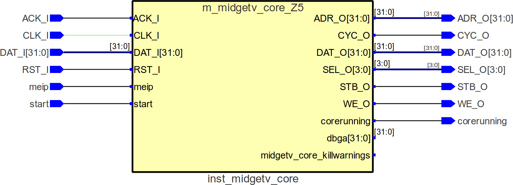

                       
## midgetv - specifically for ice40* FPGAs
   
Midgetv is non-pipelined and microcoded - it trades speed for
size. The size of Midgetv changes as it is developped, I have given up
to state a fixed number. Just now, september 2020, the following holds
for an image that can run the RISC-V compliance suite on an
`icebreaker` board:

Core    | Toolchain    | Size (SB_LUTs) | Clock (MHz) 
  :---  |  :---------  |  -----------:  |  --------:
rv32i   | Synplify Pro | 395            | 31.7
rv32im  | Lattice LSI  | 468            | 26.4
rv32imc | Yosys/Arachne| 668            | 19.2

These cores use 6 EBR rams, and 2 SPRAM256KA.

Each rv32i/rv32ic instruction use between 4 clock cycles and about 40
clock cycles (for shifts of a register by 31). Average number of
clocks per instruction (CPI) seems to be ~9. Unaligned word/hword
load/store instructions must be performed in software (something like
[this](work/sw/first/t160.S)).  CSR instructions are decoded in
microcode, but executed by [emulation software](work/sw/inc/midgetv_minimal_csr.S),
and are thus very slow. MUL/DIV is done bit serially, essentially 2
clock cycles per bit, and hence require around 75 clock cycles.  The
privilege mode of midgetv is always *machine-mode*.

### Overall goal

Make a tiny RISC-V core for the ice40 family FPGAs. The core should be
just powerfull enough to be usable in my own projects. The core should
be reasonable well debugged, so others can use it.

### Overall results
 -  Passes RISC-V rv32i/rv32im/rv32imc/rv32Zifence/rm32Zicsr compliance
    tests in simulation using Verilator
 -  Passes RISC-V rv32i/rv32im/rv32imc/rv32Zifence/rm32Zicsr compliance
    tests using an `icebreaker` board
 -  Due to the above; complience with RV32I (version 2.1), with standard 
    extensions M, C, Zicsr and Zifence (all version 2.0)
 -  Can be targeted to all ICE40 devices that have EBR ram
 -  Support for SRAM in ICE40 devices that have SRAM
 -  Wishbone b4 used for interconnect
 -  Tested on ICE40UP5K using a `icebreaker` board, 
  - Rudimentary tests on ICE40HX1K using a `iceblink40-hx1k` board and
    also on ICE40UP5K using a `UPDuino2` board, 

### Future plans, in order of priority
 - Consolidate. Increase coverage on module tests in directory [tst](work/tst).
 - Production of a monolithic source file to ease integration of `midgetv` into projects.
 - Restructure the directory-tree - it is way to complex now.
 - Test on external interrupts, no work has been done here for a long time.
 - Test on nested interrupts/exceptions, errors are expected to be found
 - Write and test exhaustive CSR code, just now only a minimum exists
 - Compliance with riscv-privileged-vX.XX.pdf
 - Table that show clockcycles used per instruction
 - Cleanup on code, and especially Makefiles
 - Documentation (strange how this tends to be last...)
 
### Software requirements

I try not to tie-in this code to any particular tools, but to compile the code with 
least effort you need:

- GNU Make
- gcc
  - On the host environment to compile some utility programs and simulation binaries.
  - As a cross compiler to compile C and assembler programs for RISC-V.
- Verilator to build the simulator(s)
- Emacs if you want to modify the code easily (for Verilog-Mode)
- A toolchain for FPGA compilation and upload, for example:
  - iCEcube2 from Lattice
  - A toolchain based on the very impressive icestorm project, such as: yosys/arachne-pnr/icepack
  The size of midgetv as stated in the start of this README is found using LSE syntethis from Lattice. 
  yosys/arachne-pnr usually give considerable larger images. For the time being I
  will not look into this.

All my work is done under Linux.

### Examples of midgetv on hardware
See [here](work/hwtst). Hardware that can implement a bit-bang UART
may load a program without Verilog recompile, see directories
[midgetv_blast](work/sw/hwexamples/midgetv_blast/) and [dynhw](work/sw/dynhw/).

### Example programs
See [here](work/sw/hwexamples)

### Simulation of midgetv in Verilator
See [here](work/tst) for the simulator code. Many small programs to
test specific instructions in midgetv is [here](work/sw/first), and
code to do the riscv compliance test suite is [here](work/sw/second).

### Running the riscv-test suite on an `icebreaker` board.
See [here](work/compliance).

### How to compile
A first time user need some instructions on how/what to compile. Presently this
is not written, but a very short introduction is [here](doc/README.md).

### Semantic Versioning API specification
1. Signal interface to module [`m_midgetv_core`](work/code/m_midgetv_core.v) is part of the API.
2. The coarse [memory map](work/sw/inc/midgetv.inc) of midgetv is part of the API. 
3. The way a binary file is mapped to `localparam` specifications by the
   utility [`midgetv_bin2ebr`](work/util/midgetv_bin2ebr.c) is part of the API.
